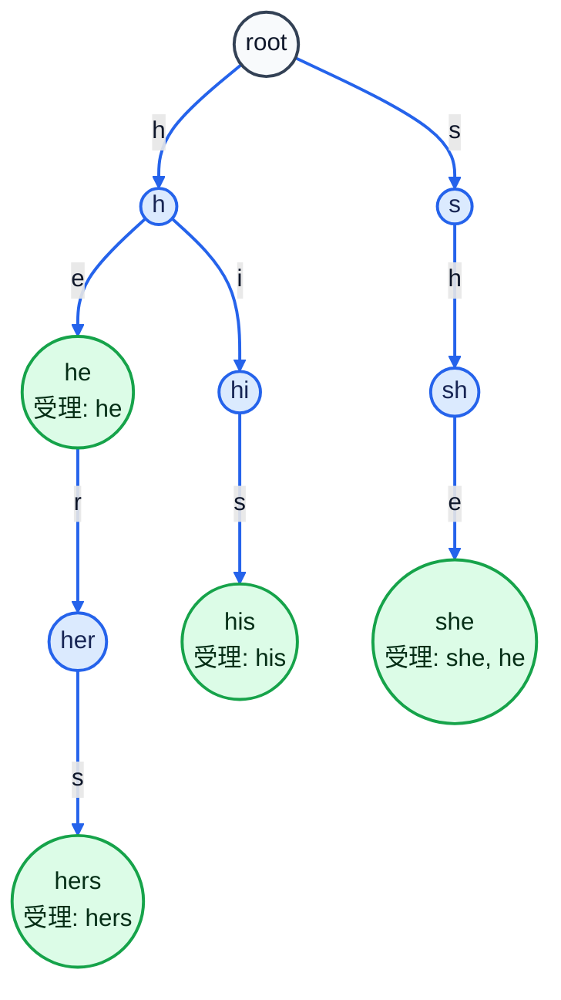
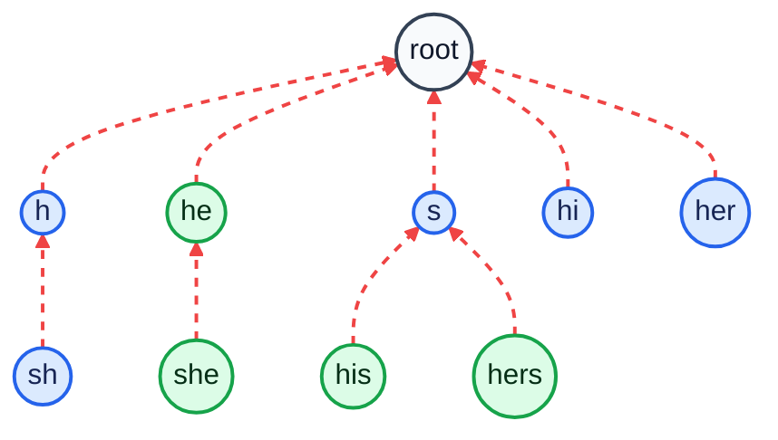

# Aho-Corasick

複数の文字列をまとめて検索します。

## Complexity

- `P`: 追加した文字列の長さの合計
- `T`: 検索する文字列の長さ
- `Z`: 見つかった個数
- Build: `O(P * 文字種数 + 出力リストの合計長)`
- Match: `O(T + Z)`
- Memory: `O(ノード数 * 文字種数 + 出力リストの合計長)`

## Code

```cpp
--8<-- "library/string/aho_corasick.hpp"
```

## Usage

```cpp
yz::AhoCorasick<> ac;
ac.add("he", 0);
ac.add("she", 1);
ac.add("hers", 2);
ac.build();

auto matches = ac.match("ushers");
```

`match` は `(終端位置, 文字列ID)` の列を返します。

## Build の例

`he`, `she`, `his`, `hers` を追加した例です。
まず Trie の形は次の通りです（辺のラベルは追加する文字）。



`build()` では BFS で浅いノードから順に `fail` を決めます。
たとえば `sh` の `fail` は `h` なので、`she` の `fail` は
`h` から `e` で進んだ `he` になります。

点線の矢印で `fail` をすべて結ぶと、次のような木になります。
どのノードからたどっても、最後は必ず `root` に着きます。



```cpp
nodes[to].fail = nodes[nodes[v].fail].next[c];
```

`to == -1` のときは、`fail` 先の遷移で `next` を埋めます。
これで `match()` 中に毎回 `fail` をたどらず、1 文字で必ず次の状態へ進めます。
下の表は、補完される `next` の代表例です。
状態 `v` が文字 `c` の辺を持たないとき、`next[v][c]` は
`fail` 先（中央列）の `next` をそのまま引き継ぎます。

| 遷移元の状態 | 入力文字 | たどる `fail` 先 | 補完される `next` |
| --- | --- | --- | --- |
| `sh` | `i` | `h` | `hi` |
| `she` | `r` | `he` | `her` |
| `his` | `h` | `s` | `sh` |
| `hers` | `h` | `s` | `sh` |
| `he` | `h` | `root` | `h` |
| `her` | `h` | `root` | `h` |
| `s` | `e` | `root` | `root` |
