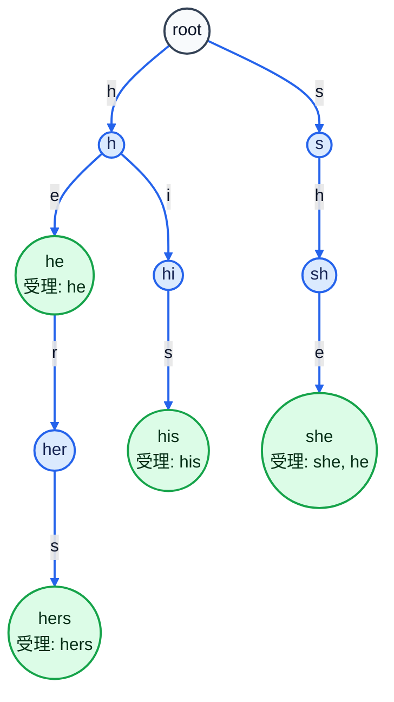
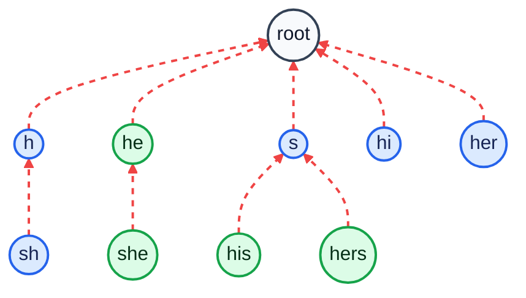

# Aho-Corasick

複数の文字列をまとめて検索します。

## Usage

```cpp
yz::AhoCorasick<> ac;
ac.add("he", 0);
ac.add("she", 1);
ac.add("hers", 2);
ac.build();

auto matches = ac.match("ushers");
```

`match` は `(終端位置, 文字列ID)` の列を返します。

## メンバー変数

- `vector<Node> nodes`
    - Aho-Corasick のノード列です。
    - `nodes[0]` が root です。

- `int word_count`
    - 追加した文字列 ID の個数です。
    - `add(s)` で自動採番するときにも使います。

- `bool built`
    - `build()` が完了しているかどうかを表します。

## 構造体

- `Node`
    - Aho-Corasick の各ノードを表す構造体です。

- `array<int, CharSize> Node::next`
    - 各文字で進んだ先のノード番号です。
    - `build()` 前は、辺がない場合 `-1` です。
    - `build()` 後は、失敗リンクを考慮した遷移先で埋められます。

- `int Node::fail`
    - 失敗リンクの先のノード番号です。

- `vector<int> Node::accept`
    - このノードに到達したときにマッチした文字列 ID の列です。
    - `build()` 後は、失敗リンク先でマッチする ID も含みます。

## コンストラクタ

- `AhoCorasick()`
    - root だけを持つ空のオートマトンを作ります。

- `Node()`
    - `next` をすべて `-1` にし、`fail` を `0` にします。

## 関数

- `static int char_to_id(char c)`
    - 文字 `c` を `0` 以上 `CharSize` 未満の番号に変換します。
    - デフォルトでは `'a'` が `0`、`'b'` が `1` です。

- `int add(const string &s)`
    - 文字列 `s` を追加します。
    - 文字列 ID は `0` から自動で割り当てます。
    - `s` の終端に対応するノード番号を返します。

- `int add(const string &s, int word_id)`
    - 文字列 `s` を ID `word_id` として追加します。
    - `s` の終端に対応するノード番号を返します。
    - `build()` の後には追加できません。

- `void build()`
    - 失敗リンクを作り、`next` を補完します。
    - 一度実行した後にもう一度呼んでも何もしません。

- `int move(int v, char c) const`
    - 状態 `v` から文字 `c` で遷移した先の状態を返します。
    - `build()` 後に使えます。

- `vector<pair<int, int>> match(const string &text) const`
    - `text` に含まれる追加済み文字列をすべて検索します。
    - 各要素は `(終端位置, 文字列ID)` です。
    - `build()` 後に使えます。

## Complexity

- `P`: 追加した文字列の長さの合計
- `T`: 検索する文字列の長さ
- `Z`: 見つかった個数
- Build: `O(P * 文字種数 + 出力リストの合計長)`
- Match: `O(T + Z)`
- Memory: `O(ノード数 * 文字種数 + 出力リストの合計長)`

## Code

```cpp
--8<-- "library/string/aho_corasick.hpp"
```

## Build の例

`he`, `she`, `his`, `hers` を追加した例です。
まず Trie の形は次の通りです（辺のラベルは追加する文字）。



`build()` では BFS で浅いノードから順に `fail` を決めます。
たとえば `sh` の `fail` は `h` なので、`she` の `fail` は
`h` から `e` で進んだ `he` になります。

点線の矢印で `fail` をすべて結ぶと、次のような木になります。
どのノードからたどっても、最後は必ず `root` に着きます。



```cpp
nodes[to].fail = nodes[nodes[v].fail].next[c];
```

`to == -1` のときは、`fail` 先の遷移で `next` を埋めます。
これで `match()` 中に毎回 `fail` をたどらず、1 文字で必ず次の状態へ進めます。
下の表は、補完される `next` の代表例です。
状態 `v` が文字 `c` の辺を持たないとき、`next[v][c]` は
`fail` 先（中央列）の `next` をそのまま引き継ぎます。

| 遷移元の状態 | 入力文字 | たどる `fail` 先 | 補完される `next` |
| --- | --- | --- | --- |
| `sh` | `i` | `h` | `hi` |
| `she` | `r` | `he` | `her` |
| `his` | `h` | `s` | `sh` |
| `hers` | `h` | `s` | `sh` |
| `he` | `h` | `root` | `h` |
| `her` | `h` | `root` | `h` |
| `s` | `e` | `root` | `root` |
